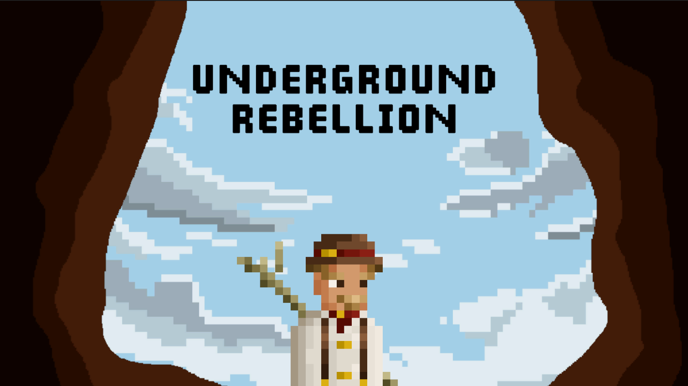

## Portfolio

---

### Projects

  
  
  

    <h3 style="margin-top: 0;"><a href="https://plbc.itch.io/underground-rebellion" style="color: #1e6bb8;">Underground Rebellion</a></h3>
    

      A 2D Pixelart action-platformer developed for PC where players have to defeat enemies by stealth or by tiring them out by defending themselves against their attacks through a parry system. In this project I was responsible for developing the player mechanics (from parry, dash, walljump, among others), UI/UX, tutorial and minimap system.
    

  

  
  

    <h3><a href="/pdf/sample_presentation.pdf">Project 2 Title</a></h3>
    
Brief description of this project. Include key features, tech stack, or your role.

  

  
  

    <h3><a href="http://example.com/">Project 3 Title</a></h3>
    
A short description of the third project. Mention any interesting challenges or results.

  

---

### Category Name 2

- [Project 1 Title](http://example.com/)
- [Project 2 Title](http://example.com/)
- [Project 3 Title](http://example.com/)
- [Project 4 Title](http://example.com/)
- [Project 5 Title](http://example.com/)

---

---

Page template forked from <a href="https://github.com/evanca/quick-portfolio">evanca</a>

<!-- Remove above link if you don't want to attibute -->
